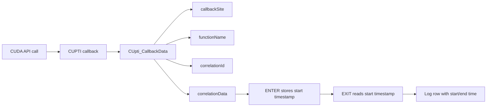

# CUDA API Mapping Capture by CUPTI

This folder contains CUDA Runtime -> Driver APIs mapping program using CUPTI Callback API. Each test program
lives in its own subdirectory, while CUDA/CUPTI headers, import libraries, and
runtime DLLs are shared through the `deps` directory.

## Environment

Required tools:

- NVIDIA CUDA Toolkit 12.6
- Visual Studio 2022 Build Tools
- Visual Studio 2022 Developer Command Prompt

Build from an **x64 Native Tools Command Prompt for VS 2022** or a
**Visual Studio 2022 Developer Command Prompt**. This is required because
`nvcc` uses the MSVC compiler toolchain.

By default, the shared Makefile expects CUDA Toolkit here:

```bat
C:\Program Files\NVIDIA GPU Computing Toolkit\CUDA\v12.6
```

If your CUDA Toolkit is installed elsewhere, pass `CUDA_PATH` to `nmake`.

## File Structure

```text
R2DMappingCapture/
  README.md
  Makefile.nmake

  common/
    common.nmake

  deps/
    cuda-12.6/
      include/
      lib/x64/
      bin/
    cupti-12.6/
      include/
      lib64/

  samples/
    test_vectoradd_callback_trace/
      test_vectoradd_callback_trace.cu
      Makefile.nmake
    test_api_mix_callback_trace/
      test_api_mix_callback_trace.cu
      Makefile.nmake
    test_memory_coverage_callback_trace/
      test_memory_coverage_callback_trace.cu
      Makefile.nmake
    ......

  build/
    bin/
    obj/
```

Important paths:

- `common/common.nmake`: shared build settings for all tests.
- `deps/cuda-12.6/include`: CUDA headers such as `cuda.h` and `cuda_runtime.h`.
- `deps/cuda-12.6/lib/x64`: CUDA import libraries such as `cuda.lib` and `cudart.lib`.
- `deps/cuda-12.6/bin`: CUDA runtime DLLs such as `cudart64_12.dll`.
- `deps/cupti-12.6/include`: CUPTI headers such as `cupti.h`.
- `deps/cupti-12.6/lib64`: CUPTI import library and runtime DLLs.
- `samples/<test_name>`: test source, test Makefile, log, and mapping outputs.
- `build/bin`: final executables and copied runtime DLLs.
- `build/obj`: reserved for intermediate build files.

## Build All Tests

From `R2DMappingCapture`:

```bat
nmake /f Makefile.nmake
```

The top-level Makefile enters each test directory listed in `TESTS` and builds
it using that test's own `Makefile.nmake`.

Run all tests from the project root:

```bat
nmake /f Makefile.nmake run
```

## Build One Test

From the test directory:

```bat
cd samples\test_vectoradd_callback_trace
nmake /f Makefile.nmake
```

The executable is written to:

```text
..\..\build\bin\test_vectoradd_callback_trace.exe
```

The Makefile also copies required runtime DLLs into `build\bin`, so the program
can run without manually setting `PATH` to the CUDA/CUPTI DLL directories.

## Run One Test

From the test directory:

```bat
nmake /f Makefile.nmake run
```

This runs:

```text
..\..\build\bin\test_vectoradd_callback_trace.exe
```

The callback trace log is written using the test target name. For this test:

```text
test_vectoradd_callback_trace.log
```

The log is generated in the sample directory:

```text
samples\test_vectoradd_callback_trace\test_vectoradd_callback_trace.log
```

## Analyze Runtime To Driver Mapping

After a log has been generated, run:

```bat
nmake /f Makefile.nmake analyze
```

From the project root, this enters each test directory and analyzes its log.
From a single test directory, it analyzes only that test.

For `test_vectoradd_callback_trace`, the analyzer writes:

```text
samples\test_vectoradd_callback_trace\test_vectoradd_callback_trace_runtime_driver_mapping.csv
samples\test_vectoradd_callback_trace\test_vectoradd_callback_trace_unmapped_driver_api.csv
samples\test_vectoradd_callback_trace\test_vectoradd_callback_trace_runtime_driver_mapping_summary.txt
```

The mapping rule is conservative:

- `nested_same_correlation`: driver API span is inside the runtime API span and
  has the same CUPTI correlation ID. This is the strongest result.
- `nested_time_window`: driver API span is inside the runtime API span, but the
  correlation ID differs.
- `overlap_*`: fallback time-window match; weaker evidence.
- unmapped driver APIs are usually initialization or direct Driver API work
  outside any Runtime API span.

## Clean

Clean one test:

```bat
cd samples\test_vectoradd_callback_trace
nmake /f Makefile.nmake clean
```

Clean all tests from the project root:

```bat
nmake /f Makefile.nmake clean
```

Remove the whole build directory:

```bat
nmake /f Makefile.nmake cleanall
```

## Add a New Test

Create a new folder:

```text
samples/
  my_new_test/
    my_new_test.cu
    Makefile.nmake
```

Use this minimal `Makefile.nmake`:

```makefile
TARGET_NAME = my_new_test
SOURCE = my_new_test.cu

!INCLUDE ..\..\common\common.nmake
```

Then add the folder name to `TESTS` in the top-level `Makefile.nmake`:

```makefile
TESTS = test_vectoradd_callback_trace my_new_test
```

After that, the root command builds both tests:

```bat
nmake /f Makefile.nmake
```

## Current Tests

`test_vectoradd_callback_trace` uses CUPTI Callback API to capture CUDA Runtime
API and Driver API callbacks. It logs callback site, function name, start time,
end time, and correlation ID for each captured API callback.

`test_api_mix_callback_trace` uses the same callback log format, but runs a
broader CUDA Runtime API mix: device queries, stream creation, event creation,
pinned host allocation, async memset/copy, kernel launch, stream/event/device
synchronization, memory release, stream/event destroy, and device reset.

`test_memory_coverage_callback_trace` targets Runtime memory APIs: managed
memory, symbol copies, host registration, pitch/3D allocation, array allocation,
2D/3D copies, memset variants, memory advice, prefetch, range attributes, and
memory info.

`test_stream_pool_callback_trace` targets stream, event, host callback, and
stream-ordered allocator APIs: stream priority/query/ID, wait-event, event
record-with-flags, async malloc/free, default mempool attributes, pool
allocation, pool trim, and host function launch.

`test_graph_coverage_callback_trace` targets CUDA Graph APIs: graph creation,
empty/memcpy/memset/kernel/host/event nodes, graph queries, node parameter
get/set, clone, instantiate, upload, launch, exec update, exec node parameter
updates, and graph destruction.

`test_device_exec_callback_trace` targets device, version, error, execution, and
occupancy APIs: device flags, PCI bus ID lookup, limits, cache config,
runtime/driver version, function attributes, occupancy helpers, and
`cudaLaunchKernelExC`.

`test_texture_surface_callback_trace` targets texture/surface object and array
memory APIs: texture object create/query/destroy, surface object
create/query/destroy, async 2D array copies, mipmapped arrays, 3D arrays, and
array property queries.

`test_graph_extra_callback_trace` extends graph coverage with child graphs,
dependency add/remove APIs, symbol memcpy graph nodes, graph instantiate
variants, user objects, debug DOT output, and additional exec/node update APIs.

`test_d3d11_interop_callback_trace` targets Direct3D 11 and generic graphics
interop APIs by creating a CUDA-compatible D3D11 device, registering D3D11
buffer/texture resources, mapping them through CUDA, querying mapped pointer
and array handles, then unregistering the resources.

`test_opengl_interop_callback_trace` targets OpenGL and generic graphics
interop APIs by creating a hidden Win32/WGL OpenGL context, registering an
OpenGL buffer and texture with CUDA, mapping/querying/unmapping the resources,
and then cleaning up the GL context.


## Callback Data Path


